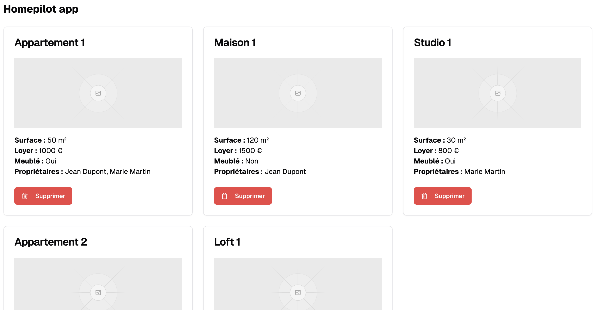
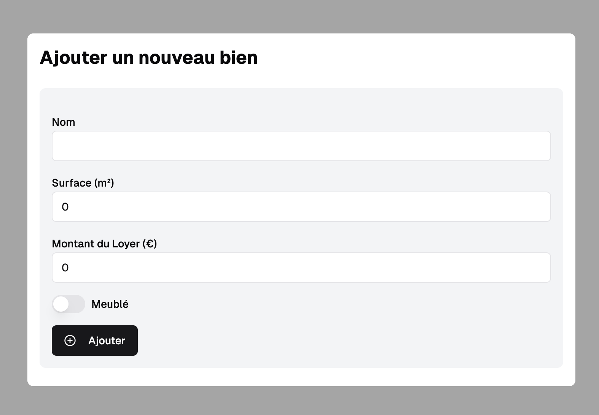

# **Test technique Homepilot**

## **Objectif**

Développer une application pour gérer des biens immobiliers et leurs propriétaires avec la stack suivante :

- **Backend** : NestJS.
- **Frontend** : React.
- **Workspace** : Nx.

---

## **Spécifications fonctionnelles**

### **Entités**

#### **Bien (Unit)**

- **Attributs** :

  - `id`: Identifiant unique.
  - `name`: Nom du bien (ex. : "Appartement 1").
  - `surface`: Surface en m².
  - `furnished`: Indique si le bien est meublé.
  - `rent_amount`: Montant du loyer (€).
  - `photo_url`: URL d'une photo du bien.
  - `created_at`: Date de création.
  - `updated_at`: Dernière mise à jour.

- **Relations** :
  - Un bien est associé à un ou plusieurs propriétaires.

#### **Propriétaire (Landlord)**

- **Attributs** :

  - `id`: Identifiant unique.
  - `first_name`: Prénom.
  - `last_name`: Nom.
  - `created_at`: Date de création.
  - `updated_at`: Dernière mise à jour.

- **Relations** :
  - Un propriétaire peut posséder plusieurs biens.

---

## **Consignes**

### **Backend**

1. **Base de données** :

   - Utiliser une base de données relationnelle.
   - Utiliser un ORM pour interagir avec la base de données, par exemple TypeORM, MikroORM ou autre dont vous devrez justifier le choix.

2. **Endpoints RESTful** :

   - **CRUD pour les biens**.
     - Afficher tous les biens.
     - Créer un bien.
     - Supprimer un bien.

---

### **Frontend**

1. **Fonctionnalités** :

   - Afficher la liste des biens avec leurs propriétaires.
   - Créer un nouveau bien.
   - Supprimer un bien existant.

   Voici un exemple de visuels non définitif pour lequel vous pouvez proposer des améliorations :

   **Homepage**

   

   **Modale d'ajout d'un bien**

   

2. **Composants UI** :

   - **UnitCard** : Affiche les détails d’un bien.
   - Composants modulaires et importés depuis `packages/ui`.

---

## **Structure du Projet**

- **Workspace NX** :

  - **Backend** : `apps/api/`.
  - **Frontend** : `apps/web/`.
  - **Composants UI partagés** : `packages/ui/`.

---

## **Livrables**

1. **Dépôt GitHub** :

   - Projet complet.
   - Instructions claires pour configurer et exécuter l'application (vous mettrez à disposition les commandes nécessaires).

2. **Projet** :

- Frontend

  - Fonctionnel et accessible à l'adresse : `http://localhost:8910/`.

- Backend

  - Fonctionnel et accessible à l'adresse : `http://localhost:8911/`.

---

## **Bonus (facultatif)**

- **Pagination** :

  - Liste des biens paginée.

- **Dockerisation** :

  - Conteneuriser le projet pour faciliter le déploiement.

---

## **Récupération et mise à disposition du projet**

Clonez/downloadez le repo puis assignez lui l'URL d'un nouveau repo git que vous aurez créé afin de pouvoir nous le partager.

Merci de ne pas forker le repo pour ne pas involontairement partager votre travail avec les autres candidats 😉

Voici les identifiants Github à ajouter en tant que collaborateur:

- @BenoitStephant
- @itsaben
- @thibmat

---

Bonne chance pour votre test technique ! 🐣
